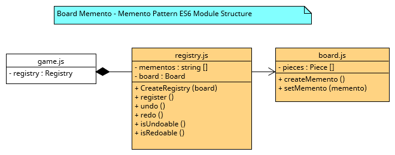

# Patterned NodeJS
**Software Design Patterns implemented on JavaScript using NodeJS.**

# Launch chess app
It is possible to execute the app for development purposes or to just run the app. So, there are two scripts for that: start and dev.

Normal execution
```
npm start
```

Nodemon execution
```
npm run dev
```

# Technical Documentation
This work serves as a study of several well-known software design patterns implemented on the JavaScript language (by using the NodeJS framework), all applied in the context of a simple chess game.

## Table of Contents
- [Introduction](#introduction)
- [Style Guide](#style-guide)
- [Project Structure](#project-structure)
- [Design Pattern Implementation](#design-pattern-implementation)

## Introduction
TBD

## Style Guide
Due to the inherent nature and versatility of implementation of design patterns, as well as the multitude of alternatives when using JavaScript, a decision was made to define a coding style guide to embrace consistency across the whole project.

The main architecture will be structured using **ES6 Modules**. To achieve this, the following style and code conventions are to be followed:

### Creating a module:
A single file will be created which will contain the new module. Filename must be written using **lowercaseCamelCase along with the .js extension** (ex: *exampleModule.js*). Module names must also be descriptive of their functionality or their relation to the domain model.

Within the file itself, methods and functions must be declared as:
```
function functionNameOnLowerCaseCamelCase (parameter1, parameter2) {
    // Function code
}
```
Function names must be descriptive of their behavior and use **verbs** that make said behavior easily understandable.

All code indentation within JavaScript modules must be done **using spaces**.

### Handling exports:
**None of the functions or variables in a module must make use of the export keyword**. All exports for the module will be handled at the end of the file in the following fashion:
```
export {
    function1,
    function2,
    constant1,
}
```
Using the default export is to be avoided when possible, priorizing usage of named exports.

### Importing modules:
Imports must be specified at the beggining of a file:
```
import { function1, function2 } from ‘./ExampleModule.js’;
```
The usage of **require() is to be avoided**.

### Using classes, OOP, and other tools:
ES6 classes should be avoided and JS modules are a natural alternative. [Stop using javascript classes](https://medium.com/giant-machines/stop-using-javascript-classes-d0b6890ef097) explains why classes are not necessary and how to implement the alternative.
### Encapsulation:
Encapsulation can be dealt with by making use of **closures**.
```
function createCounter () {
  let counter;
  function getCounter(){
    return counter;
  }
  function incrementCounter(){
    counter++;
  }
  return {
    getCounter,
    incrementCounter
  };
}
```
### Inheritance
Using the [spread operator](https://developer.mozilla.org/en-US/docs/Web/JavaScript/Reference/Operators/Spread_syntax), it is possible to return a object that augmentates (or extends) another object. As a consequence, inheritance is approached this way in the project:

```
function createObjectA(parameter) {
    let privateAttributeX = parameter;

    function privateMethod() {
        privateAttributeX++;
    }

    function publicMethod1() {
        privateMethod();
        console.log(`method1: privateAttributeX: ${privateAttributeX}`);
    }

    function publicMethod2() {
        privateMethod();
        console.log(`method2: privateAttributeX: ${privateAttributeX}`);
    }

    function parentExclusiveMethod() {
        privateMethod();
        console.log(`PARENT EXCLUSIVE: privateAttributeX: ${privateAttributeX}`);
    }

    return {
        publicMethod1,
        publicMethod2,
        parentExclusiveMethod
    }
}

function createObjectB(parameter1, parameter2) {
    const returned = createObjectA(parameter1);

    let privateAttributeY = parameter2;

    function publicMethod1() {
        console.log(`Overriden method: privateAttributeY: ${privateAttributeY}`);
    }

    function publicMethod2() {
        console.log(`Augmentated method: privateAttributeY: ${privateAttributeY}`);
        returned.publicMethod2();
    }

    function exclusiveMethod() {
        console.log(`Exclusive method: ${privateAttributeY}`);
    }

    return {
        ...returned,
        ...{
            publicMethod1,
            exclusiveMethod,
            publicMethod2,
        }
    }
}
```

An ObjectB instance will have the ObjectA extended funtionality:

```
let test = createObjectB(5, 6);
test.publicMethod1(); // Overriden method: privateAttributeY: 6
test.publicMethod2();   // Augmentated method: privateAttributeY: 6
                        // method2: privateAttributeX: 6
test.exclusiveMethod(); // Exclusive method: 6
test.parentExclusiveMethod(); // PARENT EXCLUSIVE: privateAttributeX: 7
```

The drawback of this approach is that it is not possible to access to any parent's variable from the daughter class. Nevertheless, getters and setters will be used to deal with that.

### Enums
Enums are also coded with closures and take advantage of [Object.freeze()](https://developer.mozilla.org/en-US/docs/Web/JavaScript/Reference/Global_Objects/Object/freeze), which makes impossible to extend or configure an object.

```
const SeasonEnum = Object.freeze({
    Winter: createSeason("Winter"),
    Summer: createSeason("Summer"),
    Autumn: createSeason("Autumn"),
    Spring: createSeason("Spring"),
});

function createSeason(season){
    let name = season;
    function methodA(){
        return "Season: " + name;
    }
    return{
        methodA
    }
}
```

## Project Structure
TBD

## Design Pattern Implementation
### Creational patterns
- [Singleton](#singleton)
- [Builder](#builder)
### Behavioral patterns
- [Strategy](#strategy-pattern)
- [Template Method](#template-method)
- [Memento](#memento)
### Structural patterns
- [Composite](#composite)
- [Decorator](#decorator)

#### Singleton
This pattern has been used to build the following objects:
- turn (frontend)
- boardView
- restClient
- messageManager
- randomPlayer

It has not been implemented in the same way as in other languages like Java. Commonly, a public static method will be defined and the constructor will be private. So, the static method will know if the instance has been created or not and return the instance of the type. 

```
public Class() {
    private Class instance;

    private Class() {
        // Private constructor
    }

    public static Class getInstance() {
        if(instance == null) {
            instance = new Class();
        }
        return instance;
    }
}
```

Nevertheless, in our case a constant variable has been assigned to the singleton instance, which is exported afterwards. As a consequence, no one can invoke the constructor from outside since only the object is exported, instead of the factory function.

```
const singleInstance = constructor();

function constructor() {
    function publicMethod1(){
        // method 1
    }
    
    function publicMethod2(errorMessage){
        // method 2
    }

    return {
        publicMethod1,
        publicMethod2
    }
}

export {
    singleInstance
}
```

#### Builder
Board creation and initialization is done via a builder pattern, which accepts custom board layouts as strings and features default ones.

<p align="center">
    
</p>

#### Strategy pattern
Used to manage how pieces move across the board. As so, several movement strategies exist to implement each kind of piece, which can also be swapped during execution. This is the case of the pawn piece turning into a queen when reaching the end of the board, which was solved smoothly by using this pattern to switch its movement behaviour.

<p align="center">
    
</p>

#### Template Method
Within Movement Rule strategies, the main parent class pieceMoveRule.js implements the method isPossibleMove(), which retrieves a list of movements by calling getPossibleMovements(). The list of movements varies between pieces, so each child has its own implementation, showcasing the template method pattern.

<p align="center">
    
</p>

#### Memento
Undo/Redo functionality is implemented by a memento pattern, which is also used to simulate movements when calculating checkmate possibilities.

<p align="center">
    
</p>

#### Composite
The Queen movement strategy is implemented via a composite movement of both Rook and Bishop movement strategies, while still operating the same as a normal piece movement rule.

<p align="center">
    
</p>

#### Decorator
The decorator pattern allows to easily implement functionality for the pawn to transform into a queen when making it to the end of the board. The decorator object inherits from a normal piece, implements new methods and overrides others to check and swap its piece name and movement strategy for those of a queen when conditions are met.

<p align="center">
    
</p>
