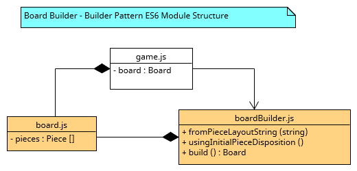
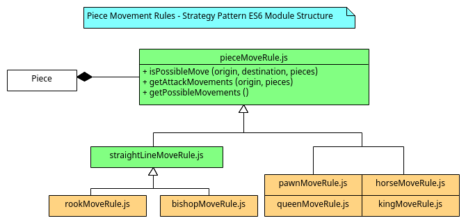
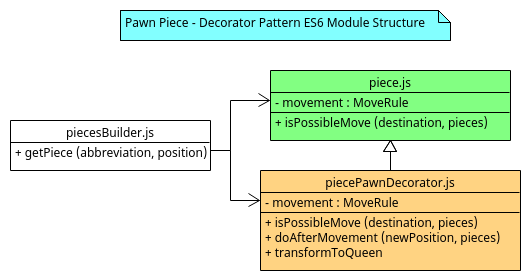

# Patterned NodeJS
**Software Design Patterns using JavaScript, on a NodeJS chess engine.**

# Launching the chess engine
It is possible to execute the application for development purposes (with enabled auto-reload), or to just normally run it. As such, there are two scripts for these scenarios: *start* and *dev*.

Normal execution
```
npm start
```

Nodemon execution
```
npm run dev
```

# Building and launching docker image
Moreover, it is possible to build a docker image of the app using the *Dockerfile*.

Building image (named chess):
```
docker build -t chess .
```
Run docker container based on the chess image:
```
docker run -dp 3000:3000 chess
```

## Using GitHub Packages
There is also the possibility of using the image uploaded to github container repo. This option will be available only being a collaborator of the project.

First of all, it is necessary to sign in to the [Container registry](https://docs.github.com/en/packages/working-with-a-github-packages-registry/working-with-the-container-registry).

Then, it is possible to pull and run the version *1.0.0*:
```
docker pull ghcr.io/mastercloudapps-projects/chess:1.0.0
docker run -dp 3000:3000 ghcr.io/mastercloudapps-projects/chess:1.0.0
```

# Technical Documentation
This work serves as a study of several well-known software design patterns implemented on the JavaScript language (by using the NodeJS platform), all applied in the context of a simple chess engine.

## Table of Contents
- [Introduction](#introduction)
- [Style Guide](#style-guide)
- [Project Structure](#project-structure)
- [Design Pattern Implementation](#design-pattern-implementation)

## Introduction
Given JavaScript's approach to OOP and the liberty it lends to the programmer, it's no surprise a plethora of different approaches exist when it comes to software design on said language.

In this work, comparative samples of different coding styles have been compiled (mainly **Classes**, **Closures**, **Factory functions** and **Constructor functions**) which can be found within the [*/codingStyles/*](https://github.com/MasterCloudApps-Projects/chess/tree/main/codingStyles) directory, together with alternatives to achieve inheritance without making use of JS' classes.

These served both as a small design study, and to decide on the coding approach to follow during development of the main software piece in this repository: A *REST API* **chess engine** running on Node.js, and implementing a number of **classic software design patterns**, which in themselves complement the coding style patterns previously mentioned as a general analysis of software design when using JavaScript.

A frontend web graphic interface has also been developed and included in this project, being accesible upon launch on *localhost:3000*.

## Style Guide
Due to the inherent nature and versatility of implementation of design patterns, as well as the multitude of alternatives when using JavaScript, a decision was made to define a coding style guide to embrace consistency across the whole project.

The main architecture will be structured using **ES6 Modules**. To achieve this, the following style and code conventions are to be followed:

### Creating a module:
A single file will be created which will contain the new module. Filename must be written using **lowercaseCamelCase along with the .js extension** (ex: *exampleModule.js*). Module names must also be descriptive of their functionality or their relation to the domain model.

Within the file itself, methods and functions must be declared as:
```
function functionNameOnLowerCaseCamelCase (parameter1, parameter2) {
    // Function code
}
```
Function names must be descriptive of their behavior and use **verbs** that make said behavior easily understandable.

All code indentation within JavaScript modules must be done **using spaces**.

### Handling exports:
**None of the functions or variables in a module must make use of the export keyword**. All exports for the module will be handled at the end of the file in the following fashion:
```
export {
    function1,
    function2,
    constant1,
}
```
Using the default export is to be avoided when possible, priorizing usage of named exports.

### Importing modules:
Imports must be specified at the beggining of a file:
```
import { function1, function2 } from ‘./ExampleModule.js’;
```
The usage of **require() is to be avoided**.

### Using classes, OOP, and other tools:
ES6 classes should be avoided in this project and JS modules are a natural alternative. [Stop using javascript classes](https://medium.com/giant-machines/stop-using-javascript-classes-d0b6890ef097) explains why classes are not necessary and how to implement said alternative.
### Encapsulation:
Encapsulation will be dealt with by making use of **closures**.
```
function createCounter () {
  let counter;
  function getCounter(){
    return counter;
  }
  function incrementCounter(){
    counter++;
  }
  return {
    getCounter,
    incrementCounter
  };
}
```
### Inheritance
Using the [spread operator](https://developer.mozilla.org/en-US/docs/Web/JavaScript/Reference/Operators/Spread_syntax), it is possible to return an object that augmentates (or extends) another object via composition. As a consequence, inheritance is approached this way in this project:

```
function createObjectA(parameter) {
    let privateAttributeX = parameter;

    function privateMethod() {
        privateAttributeX++;
    }

    function publicMethod1() {
        privateMethod();
        console.log(`method1: privateAttributeX: ${privateAttributeX}`);
    }

    function publicMethod2() {
        privateMethod();
        console.log(`method2: privateAttributeX: ${privateAttributeX}`);
    }

    function parentExclusiveMethod() {
        privateMethod();
        console.log(`PARENT EXCLUSIVE: privateAttributeX: ${privateAttributeX}`);
    }

    return {
        publicMethod1,
        publicMethod2,
        parentExclusiveMethod
    }
}

function createObjectB(parameter1, parameter2) {
    const returned = createObjectA(parameter1);

    let privateAttributeY = parameter2;

    function publicMethod1() {
        console.log(`Overriden method: privateAttributeY: ${privateAttributeY}`);
    }

    function publicMethod2() {
        console.log(`Augmentated method: privateAttributeY: ${privateAttributeY}`);
        returned.publicMethod2();
    }

    function exclusiveMethod() {
        console.log(`Exclusive method: ${privateAttributeY}`);
    }

    return {
        ...returned,
        ...{
            publicMethod1,
            exclusiveMethod,
            publicMethod2,
        }
    }
}
```

Full code can be consulted on [/codingStyles/styleProposal/](https://github.com/MasterCloudApps-Projects/chess/tree/main/codingStyles/styleProposal). In this way, an ObjectB instance will have the ObjectA extended funtionality:

```
let test = createObjectB(5, 6);
test.publicMethod1(); // Overriden method: privateAttributeY: 6
test.publicMethod2();   // Augmentated method: privateAttributeY: 6
                        // method2: privateAttributeX: 6
test.exclusiveMethod(); // Exclusive method: 6
test.parentExclusiveMethod(); // PARENT EXCLUSIVE: privateAttributeX: 7
```

The drawback of this approach is that it is not possible to access to any parent's variable from the child class, since they all can be considered private. Nevertheless, getters and setters will be used to work around this limitation.

### Enums
Enums can also coded with closures and take advantage of [Object.freeze()](https://developer.mozilla.org/en-US/docs/Web/JavaScript/Reference/Global_Objects/Object/freeze), which makes impossible to extend or configure an object.

```
const SeasonEnum = Object.freeze({
    Winter: createSeason("Winter"),
    Summer: createSeason("Summer"),
    Autumn: createSeason("Autumn"),
    Spring: createSeason("Spring"),
});

function createSeason(season){
    let name = season;
    function methodA(){
        return "Season: " + name;
    }
    return{
        methodA
    }
}
```

## Project Structure
The ajadrez architecture follows the Model-View-Controller. On the one hand the backend is decoupled with the domain model and the controllers ([*/Router/*](https://github.com/MasterCloudApps-Projects/chess/tree/main/src/backend/router)) and the frontend with the views have been decoupled on the one hand.

### Backend
The backend is invoked from the view, using the exposed REST operations of the routes.

The *Game* stands out in the model. The *Game* directs the flow of the game by interacting with the rest of the models. This component in addition to the
*GameHistory* are the models used from the routes. Thus the routes redirect the actions of the server to the model itself.

A detailed diagram of the relationships between the modules that form the backend is shown.

<p align="center">
    
</p>

### Frontend
The frontend is formed by the views with which the user interacts (identified as Player).

The *main* module is in charge of relating the DOM classes, with which the player interacts during the game progress, with the corresponding view.

The REST client is used from *GameView* and *PlayerView*. This module invokes the chess backend through http requests.

The following diagram shows the relationship between the different view modules.

<p align="center">
    
</p>

A priori, it is confusing that the interaction between the frontend and the backend is not done from a single main view (such as *GameView*).

A priori, it is confusing that the interaction between the frontend and the backend is not done from a single main view (such as *GameView*).

This was done for a reason. Chess was initially developed for a single user, the other player being the *RandomPlayer*. The CPU player is used from the view as well as the user, which allows in future versions to easily separate this functionality for a second player. When generating the *RandomPlayer* interaction it was decided to do it from an own *PlayerView* view.
## Design Pattern Implementation
Next up is a list of all the design patterns applied on the chess engine, each one along with a short description of its role within the project and its participants, followed by small UML diagram of the achieved implementation.

### Creational patterns
- [Singleton](#singleton)
- [Builder](#builder)
### Behavioral patterns
- [Strategy](#strategy-pattern)
- [Template Method](#template-method)
- [Memento](#memento)
### Structural patterns
- [Composite](#composite)
- [Decorator](#decorator)

#### Singleton
This pattern has been used at several points to build the following objects:
- turn (frontend)
- boardView (frontend)
- restClient (frontend)
- messageManager
- randomPlayer

It has not been implemented in the classic way, as in other languages like Java. Commonly, a public static method will be defined and the constructor will be private. So, the static method will know if the instance has been created or not and return the instance of the type.

```
public Class() {
    private Class instance;

    private Class() {
        // Private constructor
    }

    public static Class getInstance() {
        if(instance == null) {
            instance = new Class();
        }
        return instance;
    }
}
```

Nevertheless, in our case a constant variable has been assigned to the singleton instance, which is exported afterwards. As a consequence, no one can invoke the constructor from outside since only the object is exported, instead of the factory function.

```
const singleInstance = constructor();

function constructor() {
    function publicMethod1(){
        // method 1
    }

    function publicMethod2(errorMessage){
        // method 2
    }

    return {
        publicMethod1,
        publicMethod2
    }
}

export {
    singleInstance
}
```

#### Builder
Board creation and initialization is done via a builder pattern, which accepts custom board layouts as strings and features default ones.

<p align="center">
    
</p>

#### Strategy pattern
Used to manage how pieces move across the board. As so, several movement strategies exist to implement each kind of piece, which can also be swapped during execution. This is the case of the pawn piece turning into a queen when reaching the end of the board, which was solved smoothly by using this pattern to switch its movement behaviour.

<p align="center">
    
</p>

#### Template Method
Within Movement Rule strategies, the main parent class pieceMoveRule.js implements the method isPossibleMove(), which retrieves a list of movements by calling getPossibleMovements(). The list of movements varies between pieces, so each child has its own implementation, showcasing the template method pattern.

<p align="center">
    
</p>

#### Memento
Undo/Redo functionality is implemented by a memento pattern, which is also used to simulate movements when calculating checkmate possibilities.

<p align="center">
    
</p>

#### Composite
The Queen movement strategy is implemented via a composite movement of both Rook and Bishop movement strategies, while still operating the same as a normal piece movement rule.

<p align="center">
    
</p>

#### Decorator
The decorator pattern allows to easily implement functionality for the pawn to transform into a queen when making it to the end of the board. The decorator object inherits from a normal piece, implements new methods and overrides others to check and swap its piece name and movement strategy for those of a queen when conditions are met.

<p align="center">
    
</p>
